# Building a Secure CI/CD Pipeline using Google Cloud Native Services

## <b>Introduction</b>

DevOps is a concept that allows software development teams to release software in an automated and stable manner. DevOps itself is not just one thing; it's a combination of culture and technology, which together make the implementation of DevOps successful. 

In this blog, we will be focusing on the tools and technology side of DevOps. At the core of the technical aspect of DevOps, the concept is Continous Integration and Continous Delivery (CI/CD). The idea behind CI/CD concept is to create an automated software delivery pipeline that continuously deploys the new software releases in an automated fashion. 

The flow begins with the developers committing the code changes to a source code repository, which automatically triggers the delivery pipeline (henceforth called CI/CD pipeline) by building and deploying the code changes into various environments, from non-prod environments to production environments. 

Also, as we build the CI/CD pipelines for faster and more reliable software delivery, the security aspect should not be ignored and must be incorporated into the pipeline right from the beginning. When we build our source code, we typically use various open-source libraries and container images. Having some security safeguards within the CI/CD pipeline is imperative to ensure that the software we are building and deploying is free from any vulnerability. Additionally, it's equally important to control what type of code/container image should be allowed to be deployed on your target runtime environment. 

Security is everyone's responsibility. [Shifting left](https://cloud.google.com/architecture/devops/devops-tech-shifting-left-on-security) on security is a DevOps practice that allows you to address security concerns early in the software development lifecycle. Vulnerability scanning of container images, putting security policies in place through Binary Authorization, and allowing approved/trusted images to be deployed on GKE are a couple of ways to implement this policy to make your CI/CD pipelines more secure. 

<b>What are we building?</b>

This blog post will show how to build a secure CI/CD pipeline using Google Cloud's native services. We will create a secure software delivery pipeline that builds a sample Node.js application as a container image and deploys it on GKE clusters. 

<b>How are we building the pipeline?</b> 

We're going to use the following Google Cloud native services to build the pipeline:

1. [Cloud Build](https://cloud.google.com/build) - Cloud Build is an entirely serverless CI/CD platform that allows you to automate your build, test, and deploy tasks.
2. [Artifact Registry](https://cloud.google.com/artifact-registry) - Artifact Registry is a secure service to store and manage your build artifacts.
3. [Cloud Deploy](https://cloud.google.com/deploy) - Cloud Deploy is a fully managed Continous Delivery service for GKE and Anthos.
4. [Binary Authorization](https://cloud.google.com/binary-authorization) - Binary Authorization provides deployment time security controls for GKE and Cloud Run deployments.
5. [GKE](https://cloud.google.com/kubernetes-engine) - GKE is a fully managed Kubernetes platform.
6. [Google Pub/Sub](https://cloud.google.com/pubsub) - Pub/Sub is a serverless messaging platform.
7. [Cloud Functions](https://cloud.google.com/functions) - Cloud Functions is a serverless platform to run your code.

We use GitHub as a source code repository and Sendgrid APIs to send email notifications for approval and error logging.

The CI/CD pipeline is set up so that a Cloud Build trigger is configured to sense any code pushed to a particular repository and branch in a GitHub repository and automatically starts the build process.

Below is the flow of how the CI/CD pipeline is set up without any security policy enforcement:

1. Developer checks in the code to a GitHub repo.
2. A Cloud Build trigger is configured to sense any new code pushed to this GitHub repo and starts the 'build' process. A successful build results in a docker container image.
3. The container image is stored in Artifacts Registry.
4. The Build process kicks off a Cloud Deploy deployment process that deploys the container image to three different GKE clusters, pre-configured as the deployment pipeline mimicking the test, staging, and production environments. 
5. Cloud Deploy is configured to go through an approval step before deploying the image to the Production GKE cluster. 
6. A Cloud Function sends an email to a pre-configured email id, notifying you that a Cloud Deploy rollout requires your approval. The email receiver can approve or reject the deployment to the production GKE cluster. Cloud Function code can be found [here](https://github.com/sysdesign-code/dev-sec-ops-demo/blob/main/cloud-function/index.js)


To secure this CI/CD pipeline, we will use a couple of Google Cloud's native features and services. First, we will enable vulnerability scans on Artifact Registry, an out-of-the-box feature. Then finally, we will create a security policy using the Binary Authorization service, which only allows a specific image to be deployed to your GKE cluster. 

Below is the flow when we try to build and deploy a container image that has vulnerabilities present:

1. Developer checks in the code to a GitHub repo.
2. A Cloud Build trigger is configured to sense any new code pushed to this GitHub repo and start the 'build' process. 
3. The build process fails with the error message that vulnerabilities were found in the image. 

Below is the flow when we try to deploy a container image to GKE, which violates a Binary Authorization policy: 

1. Developer checks in the code to a GitHub repo.
2. A Cloud Build trigger is configured to sense any new code pushed to this GitHub repo and start the 'build' process. A successful build results in a docker container image.
3. The container image is stored in Artifact Registry.
4. The Build process kicks off a Cloud Deploy deployment process that deploys the container image to three different GKE clusters, pre-configured as the deployment pipeline mimicking the test, staging, and production environments. 
5. Cloud Deploy fails as the GKE clusters reject the incoming image as it violates the existing Binary Authorization policy. Please note that an approval email is still triggered before the production deployment via the Cloud Function; the email receiver is expected to reject this release based on the failures in the previous stages.
6. Once the deployment failed due to the Binary Authorization policy violation, Cloud Function sends an email to a pre-configured email id about the deployment failure. Cloud Function code can be found [here](https://github.com/sysdesign-code/dev-sec-ops-demo/tree/main/cloud-function/deployment-notification).

<b>Note</b>: The deployment fails after the timeout value is exceeded set for Cloud Deploy, which is 10 minutes by default, but you can change this value according to your requirements, see [here](https://cloud.google.com/deploy/docs/deploying-application#change_the_deployment_timeout) for more details. 

<b>Note</b>: The Cloud Function code provided for the rollout approval email and deployment failure notification is under the folder cloud-functions in this repo. You will still have to create these cloud functions with this code in your Google Cloud project to receive email notifications.

## <b>Solution Architecture</b>

The CI/CD pipeline is constructed by combining the aforementioned Google Cloud services. Cloud Build is at the center of automating the pipeline, which contains all the steps we need to build and deploy our container image. Cloud Build executes the steps defined in a YAML file sequentially. It's quite flexible in terms of how you want to define your 'build' and 'deploy' process, and the service ensures to execute those steps reliably every time.

Below are solution diagrams of how the CI/CD pipeline is set up :


As the last step of our CI process, the Cloud Build YAML triggers the Cloud Deploy service, and the container image is deployed to three different GKE clusters. Cloud Deploy automatically emits multiple notifications to pub/Sub topics throughout the deployment process. We are using Cloud Functions to listen to these Pub/Sub topics to send appropriate email notifications about the deployment status and required approvals. 


## Step-by-Step instructions for creating the CI/CD pipeline

### I. <b>Pre-Requisities</b>

These steps are required to set up and prepare your GCP environment. We highly recommend you create a new GCP Project as you will run multiple cloud services within region "us-central1". 

1. Fork the following GitHub Repo: https://github.com/sysdesign-code/dev-sec-ops-demo 
2. Create a new GCP Project, follow the steps here around how to provision and create one: https://cloud.google.com/resource-manager/docs/creating-managing-projects
3. Once your new project is created, enable Cloud SDK to allow CLI access for `gcloud` either in Cloud Shell or your local workstation. Follow the steps here: https://cloud.google.com/sdk/docs/install
4. Once you've enabled CLI access, either through your Cloud Shell or local workstation, validate or set your project ID:

    ```gcloud config set project YOUR_PROJECT_ID```

5. Run the following one-time script `/scripts/gcp_env_setup.sh`, which creates and provisions the necessary GCP cloud services required to create the DevSecOps CI/CD pipeline for deploying a sample docker application.  Here are all the service deployments that will occur once the script finishes:

    a) Enables all the required cloud service APIs such as Cloud Build, Binary Authorization, Kubernetes Service, Artiface Registry, Cloud Deploy, and many more.

    b) Create three (3) GKE clusters for test, staging, and production to show image rollout deployments across these clusters using Cloud Deploy. 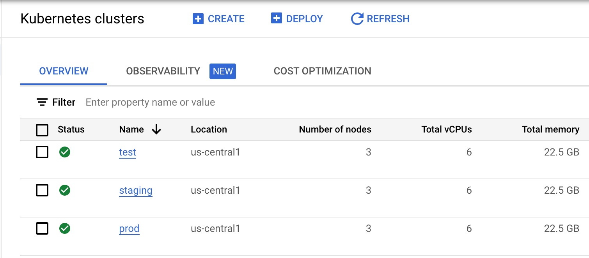 

    c) Bind all the necessary IAM roles and permissions for Cloud Build and Cloud Deploy.

    d) Create a Binary Authorization attestor, associated container note, cryptographic KMS key, and all the associated IAM roles and permissions to allow container note access for the attestor. 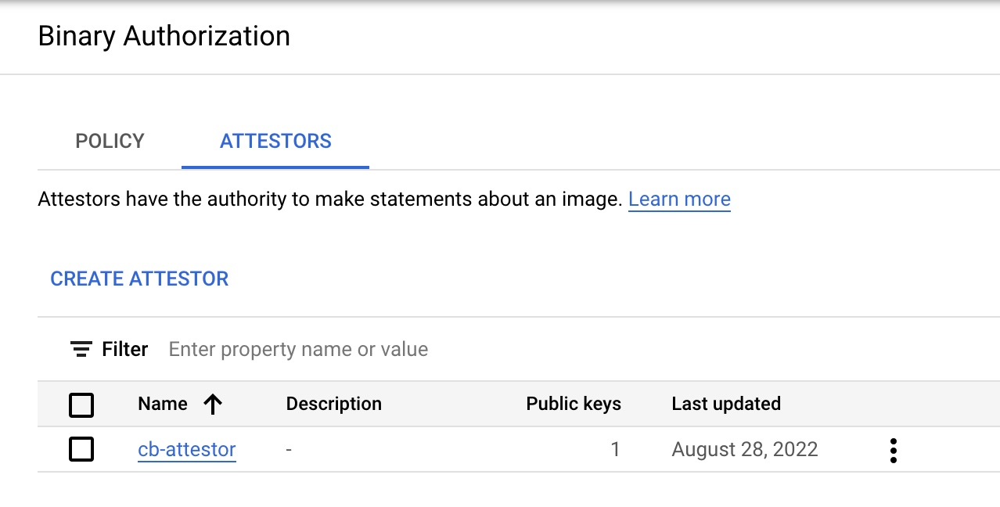

    By default, the binary authorization policy allows for all images to be deployed to GCP. Later, we will update this policy only to allow attestor-approved images to be deployed to specific GKE clusters. 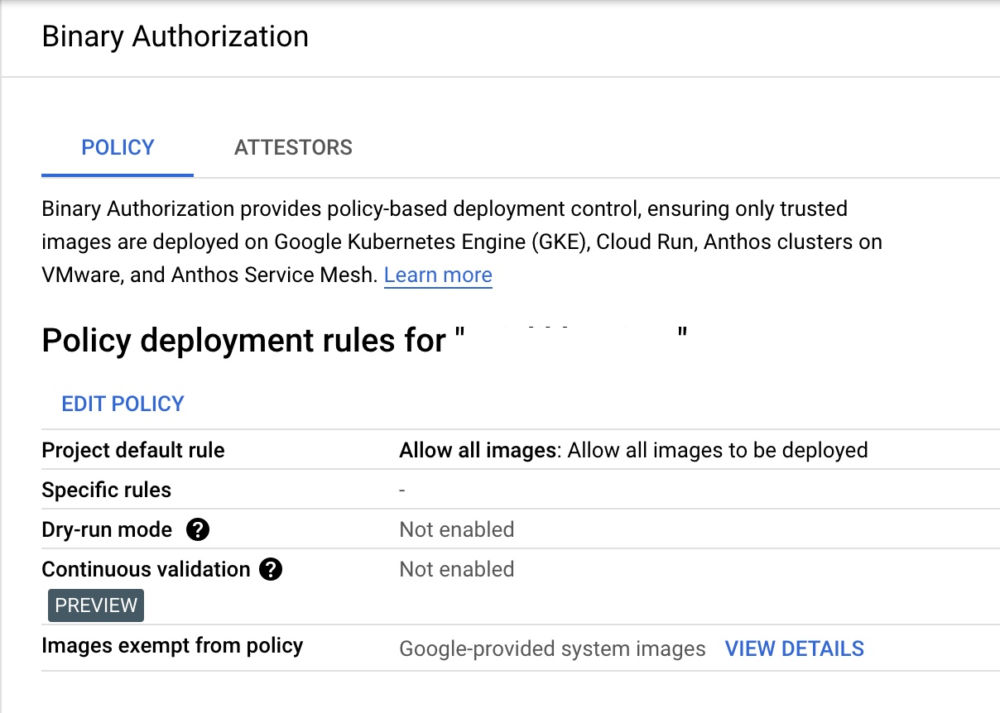 

    e) Create the Artifact Registry repository where the docker image will be stored. 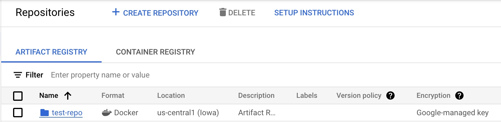

    f) Finally, create two Pub/Sub topics and Cloud Functions which will allow for email approvals for any GKE deployment to production and error reporting if a release fails.

    <b>NOTE</b>
    1. Before you run the script, please validate if your new GCP project already contains a "default" VPC and subnetwork. If you already have a "default" VPC, please go through the script and COMMENT out lines 53-55 which reference the creation of a default VPC and subnetwork. If you already have one, this step is not needed. 
    2. By default, the creation of GKE clusters uses the "default" VPC subnetwork. If you prefer to use a non-default VPC, update the GKE cluster creation commands, starting at line 157, and update the `--subnetwork` value for all 3 GKE clusters.

    To execute the script, run the following command:

    ```sh /scripts/gcp_env_setup.sh```
    
    g) This script will approximately take <b>20-22</b> minutes to complete. Once finished, the output should look similar to something like [this](/scripts/gcp_env_setup_OUTPUT.txt).

6. Create a SendGRID API Key. Follow the instructions: https://app.sendgrid.com/guide/integrate to create a free "Web API" email integration for cURL and its associated API key. Take note and save your key value and verify the integration. The key details will be needed when you create the Cloud Deploy approval process later in this blog.
<b>Note:</b> Using SendGRID APIs DOES require you to create a user account.

### II. <b>Configure Cloud Build</b>

This step requires integrating your git repository (from Pre-Requisites, Step 1) as a managed repository to GCP's cloud build service and creating the necessary Trigger. The goal of this integration is that any updates you make to your application within your GitHub repository will automatically kick off a Cloud Build deployment which will create, enable and deploy your application to GKE.

Create the GitHub Repository Integration for Cloud Build :

1. To start, from your GCP Console homepage, type "Cloud Build" within the search bar and select this service.
2. From the left-hand panel, click on "Triggers". And click on "Connect Repository."
3. Select the source as "GitHub (Cloud Build GitHub App)
4. Authenticate the connection with your GitHub credentials, select the forked/cloned repository, and click "Connect".
5. Once the integration is done, you will see your newly added repository under "Triggers" -> "Manage Repositories."
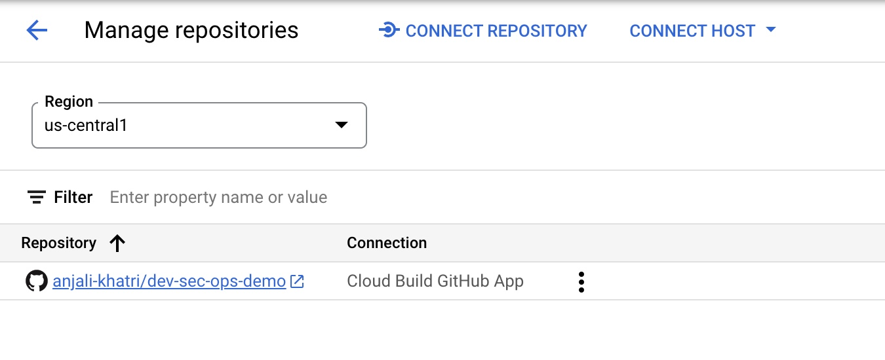

Create a Trigger for Cloud Build 

1. From the "Triggers" page, click on "+ Create Trigger"
2. Enter/Select the following values for the Trigger:
- Name: `CI/CD-blog-trigger`
- Region: `us-central1`
- Description: `Deploy Docker Image using GCP CI/CD cloud services.`
- Event: `Push to a branch.`
- Repository: Select your forked/cloned repository
- Branch: `^main$`
- Configuration: `Cloud Build Configuration File (YAML or JSON)`
- Location: `Repository`
- Cloud Build configuration file location: `/ cloudbuild.yaml`
- Under "Advanced", add the following TWO environment variables and their values: 
`_CONTAINER_REPO_NAME`: `test-repo`
`_SEVERITY`: `CRITICAL`
NOTE: The value of these env variables is case sensitive! 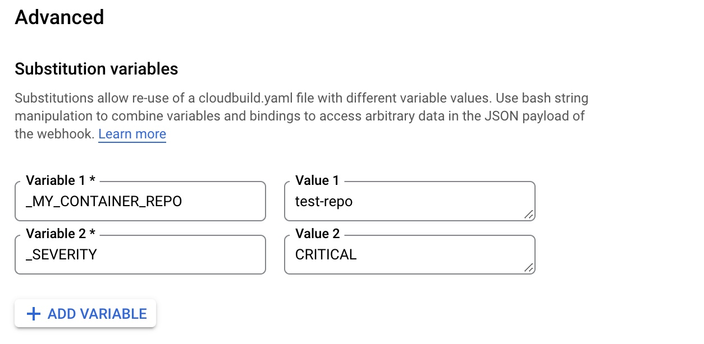
3. After the environment values are entered/selected, click "Create".

Once the Trigger is created, it will look like the following: 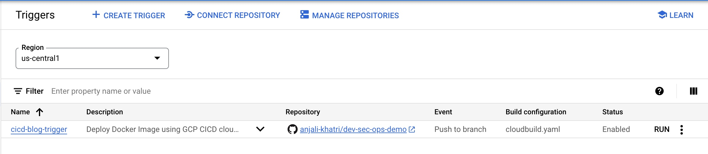

### III. <b>Create Cloud Deploy Pipeline</b>

Now that we have created GitHub integration and Cloud Build Trigger, the next step is to create the Cloud Deploy pipeline. This will deploy the container image to the three GKE environments: "test," "staging," and "prod" once the image release for all three environments is created through Cloud Build. The requirement for image release requires a Cloud Deploy pipeline.

1. Edit the clouddeploy.yaml file with your GCP project ID.
2. Within the file, update lines 22, 32, and 42 with your respective GCP project ID
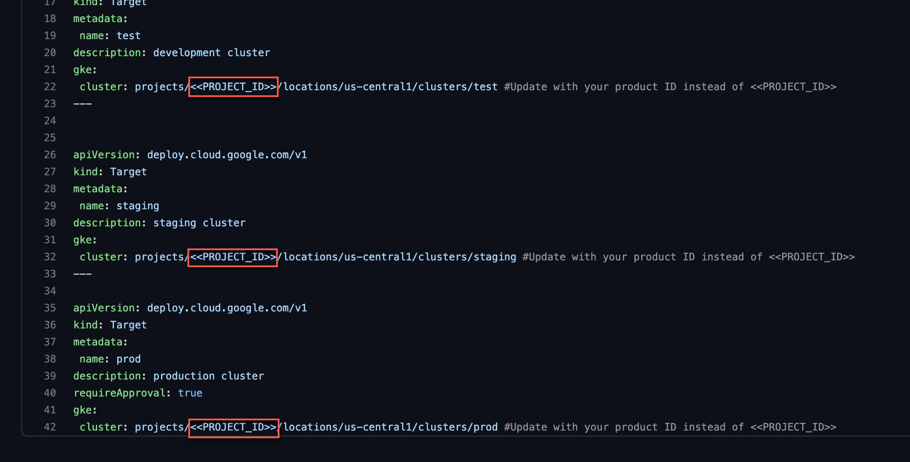
3. Once this is updated, save the file.
4. Either through Cloud Shell or your local workstation, run the following GCP command to create the environment variables and the Cloud Deploy pipeline called `ci-cd-test`: 
    ```
    PROJECT_ID=<<YOUR_PROJECT_ID>>
    LOCATION=us-central1

    gcloud deploy apply --file clouddeploy.yaml --region=$LOCATION --project=$PROJECT_ID
    ```

    NOTE: If you run into issues with a failed Cloud Deploy pipeline creation, delete the pipeline using the following gcloud command:
    ```
    gcloud deploy delivery-pipelines delete ci-cd-test --region=us-central1 --force
    ```
5. Once the pipeline is created, here is what the output will look like:
    ```
    $ gcloud deploy apply --file clouddeploy.yaml --region=$LOCATION --project=$PROJECT_ID

    Waiting for the operation on resource projects/<<YOUR_PROJECT_ID>>/locations/us-central1/deliveryPipelines/ci-cd-test...done.   
    Created Cloud Deploy resource: projects/<<YOUR_PROJECT_ID>>/locations/us-central1/deliveryPipelines/ci-cd-test.
    Waiting for the operation on resource projects/<<YOUR_PROJECT_ID>>/locations/us-central1/targets/test...done.   
    Created Cloud Deploy resource: projects/<<YOUR_PROJECT_ID>>/locations/us-central1/targets/test.
    Waiting for the operation on resource projects/<<YOUR_PROJECT_ID>>/locations/us-central1/targets/staging...done.   
    Created Cloud Deploy resource: projects/<<YOUR_PROJECT_ID>>/locations/us-central1/targets/staging.
    Waiting for the operation on resource projects/<<YOUR_PROJECT_ID>>/locations/us-central1/targets/prod...done.   
    Created Cloud Deploy resource: projects/<<YOUR_PROJECT_ID>>/locations/us-central1/targets/prod.
    ```

6. From your GCP Console homepage, type "Cloud Deploy" within the search bar and select this service.
From the main page, you will see the newly created pipeline.
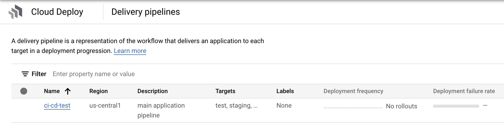


### IV. <b>Configure Email Notifications for GKE Production Cluster Deployment</b>

As part of a typical CI/CD process, any deployment of production workloads requires some form of approval process by DevOps engineers. Cloud Deploy allows you to inject an 'approval' step before deploying a rollout to the next target. We have created this approval check in our pipeline before the deployment to the 'prod' GKE cluster. Once the pipeline reaches the step to deploy the rollout to the 'prod' GKE cluster, it emits a message in the `clouddeploy-approvals` Pub/Sub topic. We have created a Cloud Function to listen to this topic and implement logic to send email notifications via Sendgrid. You can use any other library to send emails via Cloud Functions. 


The one-time script has created a Pub/Sub topic and Cloud Function, allowing your cloud build release to send an approver email.

To validate that the Pub/Sub topics and Cloud Function was created, go to those respective services and ensure they were created.

1. From your GCP Console homepage, type "Pub/Sub" within the search bar and select this service. There will be two Pub/Sub topics, and they're called `clouddeploy-approvals` and `clouddeploy-operations.`

2. From your GCP Console homepage, type "Cloud Functions" within the search bar and select this service. 
There will be two Cloud Functions, called `cd-approval` and `cd-deploy-notification`.

3. Click on `cd-approval` and select "Variables".

4. Click the "Edit" button and expand the `Runtime, build, connections and security settings.

5. Scroll down until you get to the "Runtime environment variables." Here you will update the following three variables.
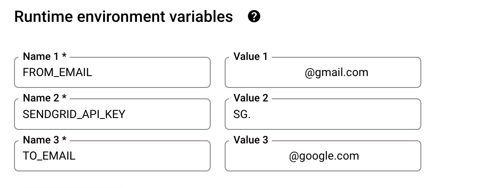
For `FROM_EMAIL`, enter a secondary email account; it could be @gmail or any other domain of your choice.
For `TO_EMAIL`, select a primary email. For instance, the email of a DevOps Engineer who will be the approver of all production workload deployments to GKE.
For `SENDGRID_API_KEY`, you will enter your API Key, starting with "SG.". If you haven't already, refer to the Pre-requisites section above, step 6, around creating this key.

6. After you've updated the cloud function environment variables, click "Next" and "Deploy" the updated function. It will take about 1-2 minutes. Once completed, the function will have a green check mark to validate its running.

7. Repeat steps 4-6 from above for the other cloud function of `cd-approval`.

## <b>Step-by-Step instructions of testing and validating the GCP CI/CD piepline</b>

Now that all the GCP prerequisites and environment setup is complete for Cloud Build, Cloud Deploy, and Email approvals, we'll next deploy the image to GKE and initiate the pipeline testing.

A couple of items to note during this test, we're going to show a "Happy" and "Vulnerable" Image deployment path to GKE.

The "Happy" path will show a successful deployment of the end-to-end pipeline across nine steps for a clean image deployment to GKE. "Clean" refers to the docker image with non-critical vulnerabilities. This path will also update the Binary Authorization policy that allows only the "Happy" image to be deployed to GKE's "test", "staging", and eventually "production" environments, which a DevOps engineer will approve.

 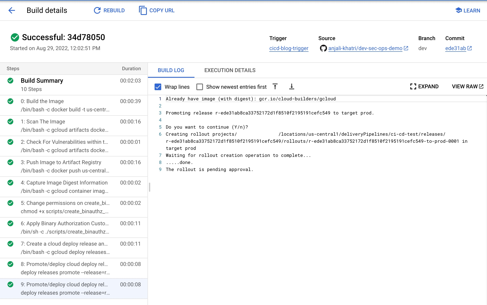

The "Vulnerable" docker path will show a failed deployment of the end-to-end pipeline across seven steps. The pipeline will fail in 2 of these steps because the image has: 
- Certain vulnerabilities must be addressed before the image can be stored in Artifact Registry. 
- A failed deployment to GKE because this is a non-approved image without attestation, violating the updated Binary Authorization policy from the "Happy" path.

When Binary Authorization is enabled, its default policy allows all images to be deployed to the GKE target environments without attestation. In the "Happy" path, we will update the default Binary Authorization policy where only a specific docker image is approved for deployment to GKE. GKE will reject any other image not approved by the Binary Authorization policy at the deployment time.

To allow other images to be deployed to GKE through an active binary authorization policy, update the following script `/scripts/create_binauthz_policy.sh` where you can sign the image digest to the existing attestor and allow for that image deployment to GKE. 

In the following sections, we'll go into further detail explaining both paths of image deployment to GKE.

### I. <b>Run Cloud Build Configuration File for "Happy" Path</b>

1. Ensure your GitHub repo is connected as a repository in Cloud Build. Refer to the "Create the GitHub Repository Integration for Cloud Build" section on how to do this.

2. Ensure your Cloud Build trigger called `CI/CD-blog-trigger` is created. Refer to the section "Create a Trigger for Cloud Build" on how to do this.

3. Since the Trigger is already enabled, any updates to your repository will trigger this Cloud Build deployment.

4. Open up the `cloudbuild.yaml` from your GitHub repo. This is the cloud build configuration file for the "Happy" Docker path.

5. To kick off the build, make any update to your codebase such as update the `/src/static/js` file for any cosmetic change.

6. After you've made the change, push the changes to your GitHub repo.

7. From the GCP Console, go to the Cloud Build service and click on "History".

8. Since the Trigger is enabled and integrated with your GitHub page, the build is automatically kicked off, and you can click the custom build number to see the log details. 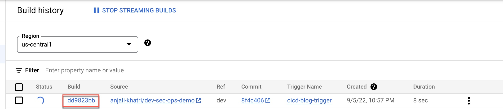

### II. <b>Validate Image Deployment for "Happy" Path</b>

1. Within that build, steps 7-9 highlight the image deployment to GKE through Cloud Deploy. If you click on step 9, the result of the build states that the deployment to "prod" is awaiting approval. 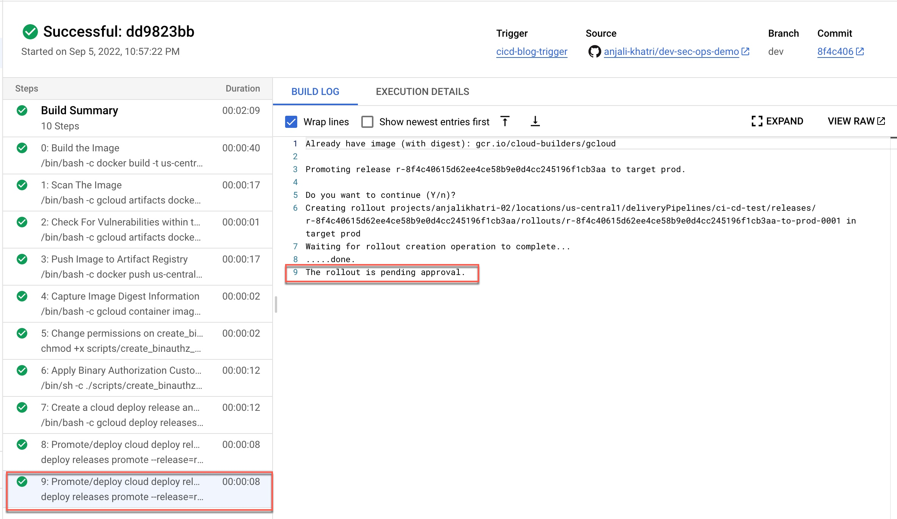

2. Go to the Cloud Deploy homepage from the GCP Console and click on the `ci-cd-test` pipeline.

3. Within the pipeline, click on the release associated with the latest cloud build deployment. Here you see that the "Happy" image is deployed successfully to both "test" and "staging", but there's an approval process required for the "prod" cluster. 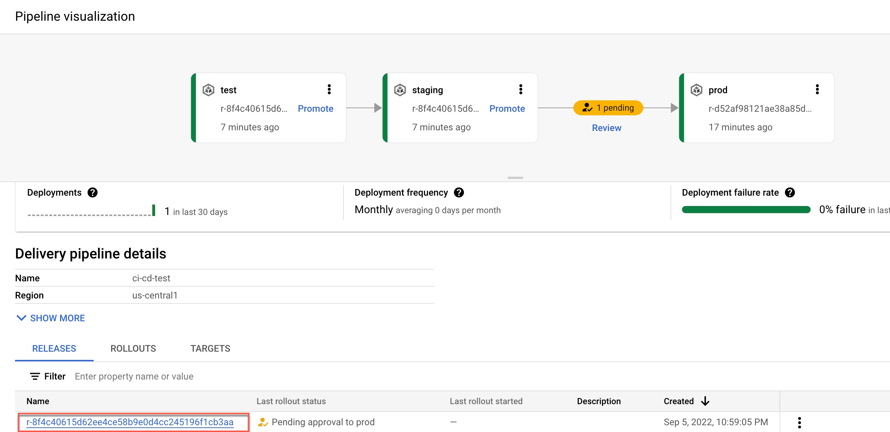

4. From the GCP Console, search for Kubernetes Engine; from the left-hand navigation, click on "Workloads." Here you can see, that the image deployment is successful in the two "test" and "staging" GKE environments. 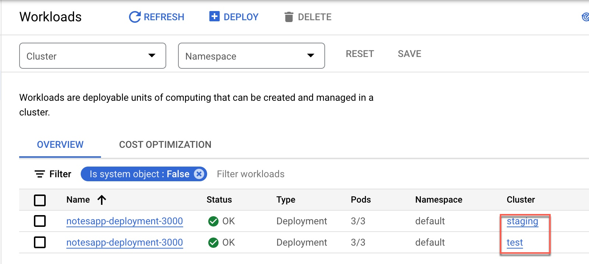

5. Now that the deployment is queued for production, check your primary email and validate that you received a notification for approval. It will look something like this. 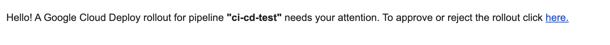 From the email, click the `here` hyperlink and it will take you to the Cloud deploy pipeline page.

6. From the Pipeline page, approve or reject the release so the deployment can be pushed to "prod" in GKE. In this case, we will approve. 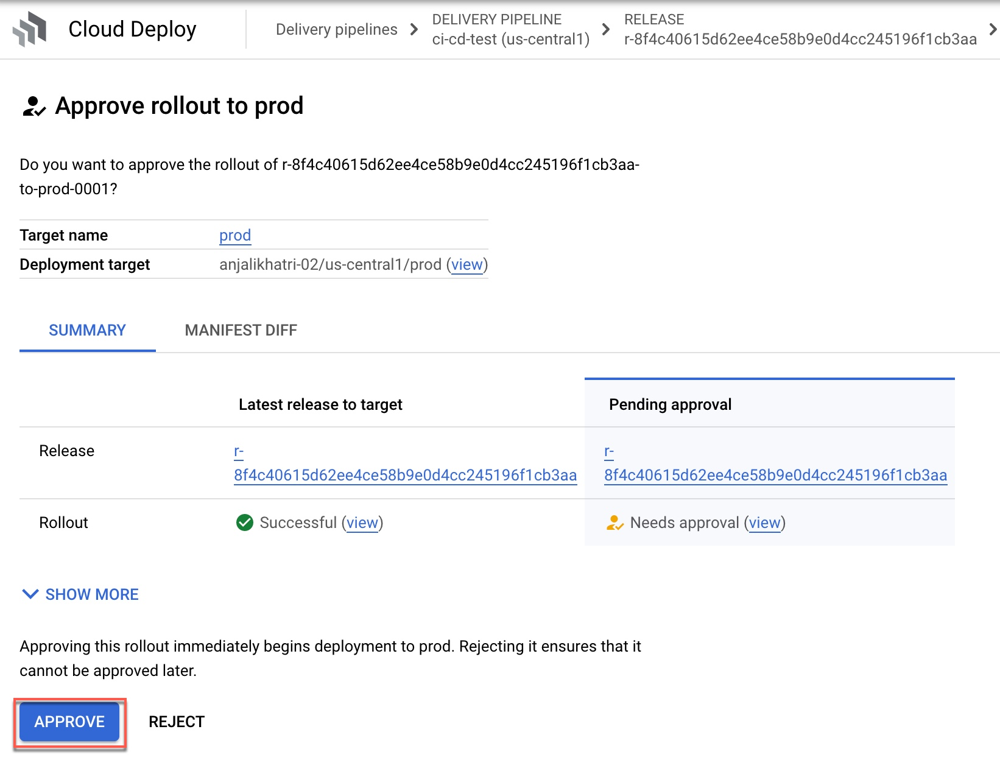

7. If you go back to the Kubernetes workload page, you'll see that the image rollout to prod was successful. 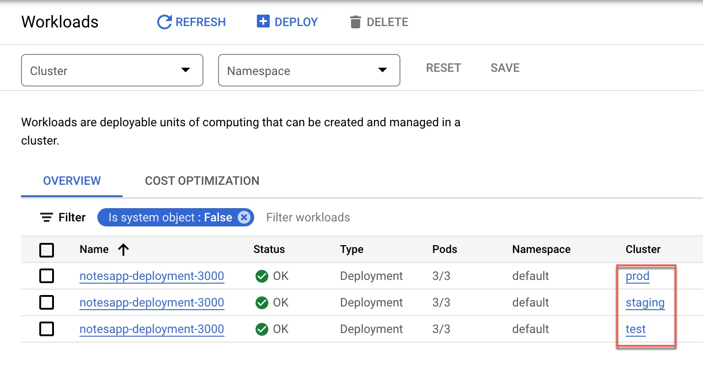 In parallel, validate your Cloud Deploy, continuous deployment pipeline also confirms a successful rollout. 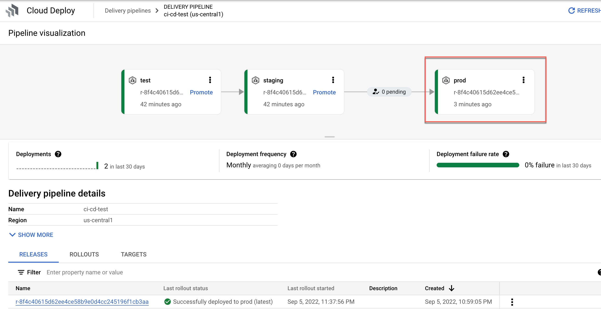

### III. <b>Run Cloud Build Configuration File for "Vulnerable" Path (container image has vulnerabilities)</b>

We will show two failure paths with this deployment: image vulnerabilities and Binary Authorization policy enforcement.

A. First, failed deployment to push docker image to Artifact Registry because of severity-specific vulnerabilities -

1. Ensure your GitHub Repo is connected as a repository in Cloud Build. Refer to the "Create the GitHub Repository Integration for Cloud Build" section on how to do this.

2. Ensure your Cloud Build Trigger called `CI/CD-blog-trigger` is created. Refer to the section "Create a Trigger for Cloud Build" on how to do this.

3. Since the Trigger is already enabled, any updates to your repository will trigger this cloud build deployment.

4. View the `cloudbuild-vulnerable.yaml` file from your GitHub repo. This is the cloud build configuration file for the "Vulnerable" Docker path.

5. Edit the existing Trigger with the following: 

- Click on the ellipses next to "RUN" and update the "Cloud Build configuration file location" to be: `cloudbuild-vulnerable.yaml` 

- Update the "_SEVERITY" environment variable value to be `HIGH`. We're changing the severity of the vulnerabilities because the vunerability check will either PASS or FAIL a cloud build deployment if the image contains ANY `HIGH` vulnerabilities. 

- Save the Trigger and validate its status as "Enabled".

6. To kick off the build, make any update to your codebase, such as updating the `/src/static/js` file for any cosmetic change. After you've made the change, push the changes to your GitHub repo.

7. From the GCP Console, go to the Cloud Build service and click on "History".

8. The build will fail in `Step 2: Check For Vulnerabilities within the Image` because this image contains `HIGH` vulnerabilities, and cloud build will NOT push this image to be stored in the artifact registry. 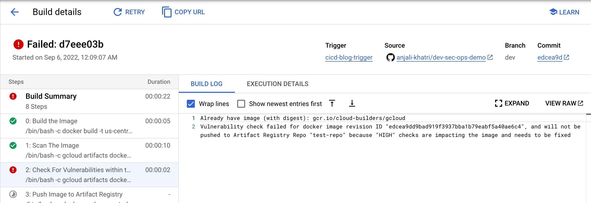

B. Second, a failed image deployment to GKE because of Binary Authorization policy enforcement -

1. Go back to the Trigger configuration for this build and change the "_SEVERITY" environment variable value to `CRITICAL` instead of "HIGH".

2. To kick off the build, make any update to your codebase such as update the `/src/static/js` file for any cosmetic change. After you've made the change, push the changes to your GitHub repo.

3. From the GCP Console, go to the Cloud Deploy pipeline `ci-cd-test` and check the results of this latest release.

4. From the Cloud Deploy pipeline page, approximately 10 minutes later, the build for "test" and "staging" will eventually fail because the Kubernetes manifest file for this docker image timed out.  You can change the timeout period to be shorter; additional details can be found [here](https://cloud.google.com/deploy/docs/deploying-application#change_the_deployment_timeout)

5. From the GCP Console, go to the GKE page and click on "Workloads". Here you will see the image deployments to both the "test" and "staging" GKE environments failed. The reason being is binary authorization policy enforcement. The "vulnerable" docker image is not approved for deployment. 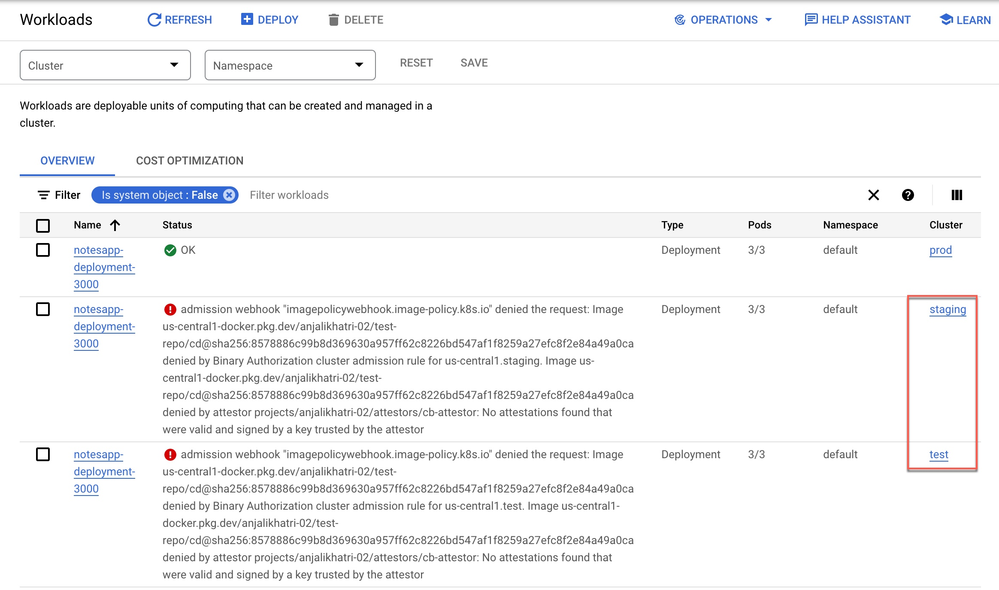

6. In parallel to a failed deployment to any of the GKE staging environments, Cloud Function `cd-deploy-notification` will send the following email to check the logs for the pipeline. 

7. From the email, click on `here to see deployment logs`, and it will take you to the log files within cloud build around additional details on the failure of the release rollout to GKE. 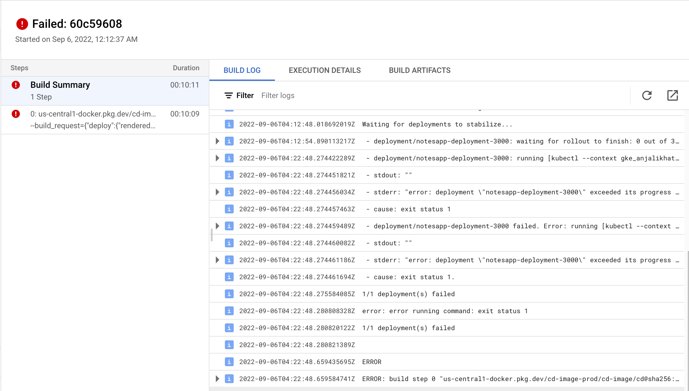

## <b>Conclusion and Further Reading</b>

In this blog post, we built a secure CI/CD pipeline using Google Cloud's native services. 

We learned how we can secure a CI/CD pipeline using Google Cloud's native services, such as Binary Authorization and Vulnerability scanning of the container images. We only saw one way to put some control on specific images that can be deployed to a GKE cluster. Binary Authorization also offers [Build Verification](https://cloud.google.com/binary-authorization/docs/overview#attestations), in which Binary Authorization uses attestations to verify that an image was built by a specific build system or continuous integration (CI) pipeline such as Cloud Build. 

Additionally, Binary Authorization also writes all the events where the deployment of a container image is blocked due to the constraints defined by the security policy to the audit logs. You can create alerts on these log entries and notify the appropriate team members about the blocked deployment events.

Lastly, all of the services used to build and secure the CI/CD pipeilines are serverless, which makes it very easy to spin up the whole infrastructure within a few minutes without worrying about maintaining or managing it, so that your teams can focus on building and releasing software in a faster, reliable and cost efficient manner.
