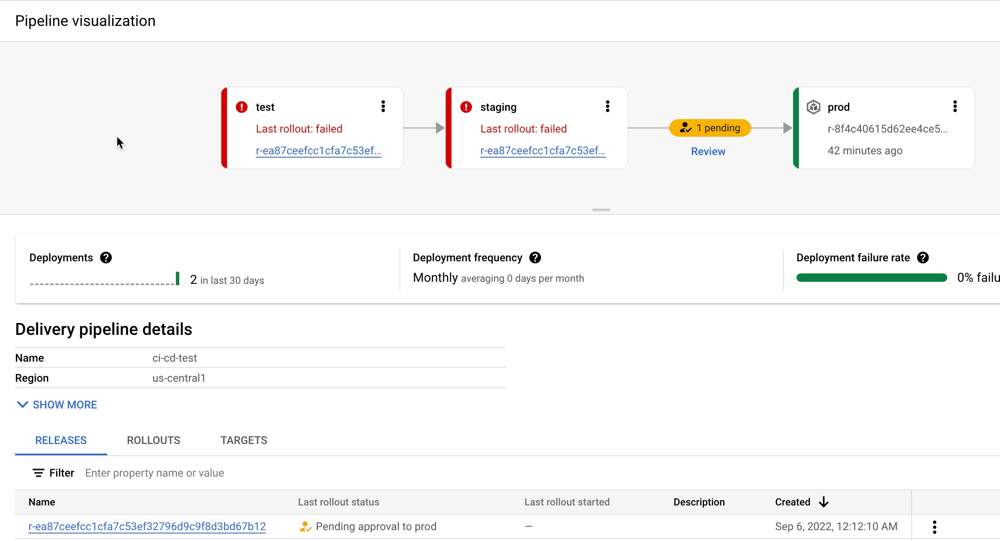

# Building a secure DevSecOps CICD delivery pipeline using Google Cloud  

## <b>Introduction</b>

DevOps is a concept which allows software development teams to release software in an automated and stable manner. DevOps itself is not just one thing, it's a combinatin of culture and technology, which together make the implementation of DevOps successful. 

In this blog, we will be focusing on the tools and technology side of DevOps. At the core of the technical aspect of DevOps concept is Continous Integration and Continous Delivery (CI/CD). The idea behind CI/CD concept is to create an automated software delivery pipeline which continoiusly deploys the new software releases in an automated fashion. 

The flow begins with the developers commitng the code changes to a source code repository, which automatically triggers the delivery pipeline (henceforth called CI/CD pipeline) by building and deploying the code changes into various enviornments starting from non-prod enviornments to production enviornment. 

Also, as we build the CI/CD pipelines for faster and reliable software delivery, the security aspect should not be ignored and must be incorporated into the pipeline right from the beginning. When we build our source code, we typically make use of various open source libraries and container images and it's imperetive to have some security safe guards within the CI/CD piepline to ensure that the software we are building and deploying is free from any vulnerability. Additionally, it's equally important to have control over what type of code/container image should be allowed to be deployed on your target runtime enviornment. 

Security is everyone's responsibility. [Shifting left](https://cloud.google.com/architecture/devops/devops-tech-shifting-left-on-security) on security is a DevOps practice which allows you to address security concerns early in the software development lifecycle. Vulnerability scaning of the container images and putting security policies in place using Binary Authorization to allow only known/trusted images to be deployed on GKE are a couple of ways to implement this policy to make your CI/CD pipelines more secure. 

<b>What are we building?</b>

In this blog post, we will show how to build a secure CI/CD pipeline using Google Cloud's native services. We will create a secure software delivery pipeline which builds a sample Nodjs application as a container image and deploys it on GKE clusters. 

<b>How are we building the pipeline?</b> 

We we going to use the following Google Cloud native services to build the pipeline:

1. [Cloud Build](https://cloud.google.com/build) - Cloud Build is a completely serverless CI/CD platform allows you to automate your build, test and deploy tasks.
2. [Artifact Registry](https://cloud.google.com/artifact-registry) - Artifact Registry is a service to securely store and manage your build artifacts.
3. [Cloud Deploy](https://cloud.google.com/deploy) - Cloud Deploy is a fully managed Continous Delivery service for GKE and Anthos.
4. [Binary Authorization](https://cloud.google.com/binary-authorization) - Binary Authorization provides deploy time security controls for GKE and Cloud Run deployments.
5. [GKE](https://cloud.google.com/kubernetes-engine) - GKE is a fully managed Kubernetes platform.
6. [Google Pub/Sub](https://cloud.google.com/pubsub) - Pub/Sub is a serverless messaging platform.
7. [Cloud Functions](https://cloud.google.com/functions) - Cloud Functions is a serverless platform to run your code.

We are are using github as a source code reporsitory and Sendgrid APIs to send email.

The CI/CD piepeline is setup in a way that a Cloud Build trigger is configured to sense any code push to a certain reporsitory and branch in a github repository and it automatically starts the build process.

Below is the flow of how the CI/CD piepeline is setup, without any security policy enforecement:

1. Developer checks in the code to a github repo.
2. A Cloud Build trigger is configured to sense any new code push to this github repo and starts the 'build' process. A successful build results into a docker container image.
3. The container image is stored into Artifacts Registry.
4. The Build process kicks of a Cloud Deploy deployment process which deploys the container image to three different GKE clusters, which are pre-configured as the deployment pipeline mimicing the test, staging and production environments. 
5. Cloud Deploy is configured to go through an approval step before deploying the image to the Production GKE cluster. 
6. A Cloud Function sends an email to a pre-configured email id, notifying that a Cloud Deploy rollout requires your approval. The reciever of the email can then either approve or reject the deployment to the production GKE cluster. Cloud Function code can be found [here](https://github.com/sysdesign-code/dev-sec-ops-demo/blob/main/cloud-function/index.js)


In order to secure this CI/CD pipeline, we will make use of a couple of Google Cloud's native features and services. First, we will enable vulerability check on the Artificats Registry, which is a out of the box feature. Then finally, we will create a security policy using Binary Authorization service which only allows certain image to be deployed on a GKE cluster. 

Below is the flow when we try to build and deploy a container image which has vulerabilities present:

1. Developer checks in the code to a github repo.
2. A Cloud Build trigger is configured to sense any new code push to this github repo and start the 'build' process. 
3. The build process fails with the error message that some critical vulerabilities were found in the image.

Below is the flow when we try to deploy a container image to GKE which violates a Binary Authorization policy: 

1. Developer checks in the code to a github repo.
2. A Cloud Build trigger is configured to sense any new code push to this github repo and start the 'build' process. A successful build results into a docker container image.
3. The container image is stored into Artifacts Registry.
4. The Build process kicks of a Cloud Deploy deployment process which deploys the container image to three different GKE clusters, which are pre-configured as the deployment pipeline mimicing the test, staging and production environments. 
5. Cloud Deploy fails as the GKE clusters reject the incoming image as it voilates the Binary Authorization policy. Please note that an approval email is still triggered before the production deployment via the Cloud Function, the reciever of the email is expected to reject this release based upon the failures in the previous stages.
6. Once the deployment is failed due to the Binary Authorizatin policy voilation, a Cloud Function sends an email to a pre-configured email id about the deployment failure. Cloud Function code can be found [here](https://github.com/sysdesign-code/dev-sec-ops-demo/tree/main/cloud-function/deployment-notification).

Note - The deployment fails after the timeout value is exceeded set for Cloud Deploy, which is 10 minutes by default, but you can change this value according to your requirements, see [here](https://cloud.google.com/deploy/docs/deploying-application#change_the_deployment_timeout) for more details. 


- Note : The Cloud Functions code provided for the rollout approval email and deployment failure notification is under the folder cloud-functions in this repo. You will still have to create these cloud functions with this code in your Google Cloud project to recieve email notifications.

## <b>Solution Architecture</b>

When you're setting up your environment for CICD, here are some of the prerequisities that's required before you can kick off your DevSecOps pipeline for managing and deploying applications on GCP using our documented CICD process.

1. Create a new GCP project and ensure you have access to the Cloud Console and enable the APIs for Cloud Shell. 

2. The GitHub repo that contains all of the sourcecode for this CICD process is [here](https://github.com/sysdesign-code/dev-sec-ops-demo). You can either "fork" or "clone" the repo to your personal GitHub environment and access via Cloud Shell or your personal desktop.

3. Within the GitHub repo, we have a one-time script that needs to be run which will enable and create the necessary steps for building your application framework and how to deploy and manage that application in GCP

4. After the one-time-script finishes, the cloud build configuration file, in sequential order, will create a continuous integration of managing the roll-out of your container image on GCP.


5. Once the continuous integration process is setup, continuous deployment can be done using Cloud Deploy for rolling out your image deployments across multiple GKE clusters for application lifecycle of test and staging environments. Before rolling out into production, DevOps/SRE teams can approve/reject the roll-outs based on the outcome of test and staging environments. 


## Step-by-Step instructions of creating the GCP CI/CD piepline

### I. <b>Pre-Requisities</b>

These steps are required to setup and prepare your GCP environment. We highly recommend you create a new GCP Project as you're going to be running multiple cloud services within region "us-central1". 

1. Fork or Clone the following GitHub Repo: https://github.com/sysdesign-code/dev-sec-ops-demo 
2. Create a new GCP Project, follow the steps here around how to provision and create one: https://cloud.google.com/resource-manager/docs/creating-managing-projects
3. Once your new project is created, enable Cloud SDK to allow CLI access for `gcloud` either in Cloud Shell or Personal Desktop. Follow the steps here: https://cloud.google.com/sdk/docs/install
4. Once you've enabled CLI access, either through your Cloud Shell or local workstation, validate or set your project ID:

    ```gcloud config set project YOUR_PROJECT_ID```

5. Run the following one-time script `/scripts/gcp_env_setup.sh` which creates and provisions the necessary GCP cloud services that will be required to create the DevSecOps CICD pipeline for deploying a sample docker application. Here's all the service deployments that will occur once the script finishes:

    a) Enables all the required cloud service APIs such as: Cloud Build, Binary Authorization, Kubernertes Service, Artiface Registry, Cloud Deploy and many more.

    b) Create three (3) GKE clusters for test, staging and production to show image roll-out deployments, across these clusters, using Cloud Deploy.  

    c) Bind all the necessary IAM roles and permissions for Cloud Build and Cloud Deploy.

    d) Create Binary Authorization attestor, associated container note, cryptographic KMS key and all the associated IAM role and permissions to allow container note access for the attestor. 
    By default, the binary authorization policy allows for all images to be deployed to GCP. Later, we will update this policy to only allow attestor approved images to be deployed to specific GKE clusters.
     

    e) Create the artifact registry repository where the docker image will be stored. 

    f) Finally, create a pub/sub topic and cloud function which will allow for email approvals for any GKE deployment to production.

    <b>NOTE</b>
    1. Before you run the script, please validate if your new GCP project already contains a "default" VPC and subnetwork. If you already have a "default" VPC, please go through the script and COMMENT out lines 53-55 which reference the creation of a default VPC and subnetwork. If you already have one, this step is not needed. 
    2. By default, the creation of GKE clusters uses the "default" VPC subnetwork. If you prefer to use a non-default VPC, update the GKE cluster creation commands, starting at line 157 and udpate the `--subnetwork` value for all 3 GKE clusters.

    To execute the script, run the following command:

    ```sh /scripts/gcp_env_setup.sh```
    
    g) This script will approximately take <b>20-22</b> minutes to complete. Once finished, the output should look similar to something like [this](/scripts/gcp_env_setup_OUTPUT.txt).

6. Create a SendGRID API Key. Follow the instructions here: https://app.sendgrid.com/guide/integrate to create a free "Web API" email integration for cURL and its associated API key. Take note and save your key value and verify the integration. The key details will be needed when you create the Cloud Deploy approval process later on in this blog.

    Note: Using SendGRID APIs does require you to create a user account.

### II. <b>Configure Cloud Build</b>

This step requires integrating your forked/cloned github (from Pre-Requisities, Step 1) as a managed repository to GCP's cloud build service and creating the necessary trigger. The goal of this integration means that any updates that you make to your application within your forked/cloned GitHub page, will automically kick off a cloud build deployment which will create, enable and deploy your application to GKE.

Create the GitHub Repository Integration for Cloud Build

1. To start, from your GCP Console homepage, type "Cloud Build" within the search bar and select this service.
2. From the left hand panel, click on "Triggers". And click on "Connect Repository"
3. Select the source as "GitHub (Cloud Build GitHub App)
4. Authenticate the connection with your GitHub credentials and select the forked/cloned repository, and click "Connect".
5. Once the integration is done, you will see your newly added repository under "Triggers" -> "Manage Repositories".


Create a Trigger for Cloud Build 

1. From the "Triggers" page, click on "+ Create Trigger"
2. Enter/Select the following values for the Trigger:
- Name: `cicd-blog-trigger`
- Region: `us-central1`
- Description: `Deploy Docker Image using GCP CICD cloud services`
- Event: `Push to a branch`
- Repository: Select your forked/cloned repository
- Branch: `^main$`
- Configuration: `Cloud Build Configuration File (yaml or json)`
- Location: `Repository`
- Cloud Build configuration file location: `/ cloudbuild.yaml`
- Under "Advanced", add the following TWO environment variables and its values: 
`_CONTAINER_REPO_NAME`: `test-repo`
`_SEVERITY`: `CRITICAL`
NOTE: The value of these env variables is case sensitive! 
3. After the environment values are entered/selected, click "Create".

Once the trigger is created, it will look like the following: 

### III. <b>Create Cloud Deploy Pipeline</b>

Now that we have GitHub integration and Trigger created for Cloud Build, the next step is to create the Cloud Deploy pipeline which will deploy the docker application to the three GKE environments: "test", "staging" and "prod" once the image release for all 3 environments is created through Cloud Build. The requirement for the image release, requires a Cloud Deploy pipeline.

1. Edit the Cloud Deploy YAML with your GCP project ID. From your forked/cloned GitHub page, click on `clouddeploy.yaml`.
2. Within the file, update lines 22, 32 and 42 with your respective GCP project ID

3. Once this is updated, save the file.
4. Either through Cloud Shell or your local dekstop, run the following GCP command to create the enviroment variables and the Cloud Deploy pipeline called `ci-cd-test`: 
    ```
    PROJECT_ID=<<YOUR_PROJECT_ID>>
    LOCATION=us-central1

    gcloud deploy apply --file clouddeploy.yaml --region=$LOCATION --project=$PROJECT_ID
    ```

    NOTE: If you run into issues with a failed Cloud Deploy pipeline creation, delete the pipeline using the following gcloud command:
    ```
    gcloud deploy delivery-pipelines delete ci-cd-test --region=us-central1 --force
    ```
5. Once the pipeline is created, here is what the output will look like:
    ```
    $ gcloud deploy apply --file clouddeploy.yaml --region=$LOCATION --project=$PROJECT_ID

    Waiting for the operation on resource projects/<<YOUR_PROJECT_ID>>/locations/us-central1/deliveryPipelines/ci-cd-test...done.   
    Created Cloud Deploy resource: projects/<<YOUR_PROJECT_ID>>/locations/us-central1/deliveryPipelines/ci-cd-test.
    Waiting for the operation on resource projects/<<YOUR_PROJECT_ID>>/locations/us-central1/targets/test...done.   
    Created Cloud Deploy resource: projects/<<YOUR_PROJECT_ID>>/locations/us-central1/targets/test.
    Waiting for the operation on resource projects/<<YOUR_PROJECT_ID>>/locations/us-central1/targets/staging...done.   
    Created Cloud Deploy resource: projects/<<YOUR_PROJECT_ID>>/locations/us-central1/targets/staging.
    Waiting for the operation on resource projects/<<YOUR_PROJECT_ID>>/locations/us-central1/targets/prod...done.   
    Created Cloud Deploy resource: projects/<<YOUR_PROJECT_ID>>/locations/us-central1/targets/prod.
    ```

6. From your GCP Console homepage, type "Cloud Deploy" within the search bar and select this service.
From the main page, you will see the newly created pipeline.


### IV. <b>Configure Email Approval for GKE Production Cluster Deployment</b>

As part of a typical CICD process, any deployment of production workloads require a form of approval process by DevOps engineers. 
With Cloud Deploy, you can implement an email approval through SendGrid that will allow you to "approve" or "reject" any cloud deploy pipeline for production workloads into GKE.

During the one-time-script run, this process created that a Pub/Sub topic and Cloud Function which will allow your cloud build release to send an approver email, through SendGrid.

To validate the Pub/Sub topics and Cloud Function was created, go to those respective services and ensure they were created.

1. From your GCP Console homepage, type "Pub/Sub" within the search bar and select this service. There will be two Pub/Sub topics and they're called `clouddeploy-approvals` and `clouddeploy-operations`.

2. From your GCP Console homepage, type "Cloud Functions" within the search bar and select this service. 
There will be two Cloud Functions and they're called `my-blog-function` and `my-blog-operations`.

3. Click on `my-blog-function` and select "Variables".

4. Click the "Edit" button and and expand the `Runtime, build, connections and security settings`.

5. Scroll down until you get to the "Runtime environment variables". Here you will update the following 3 variables.

For `FROM_EMAIL`, enter a secondary email account, it could be @gmail or any other domain of your choice.
For `TO_EMAIL`, select a primary email. For instance, the email of a DevOps Engineer's who will be the approver of all production workload deployments to GKE.
For `SENDGRID_API_KEY`, you will enter you API Key which will start with "SG.". If you haven't already, refer back to Pre-requisites section above, step 6 around how to create this key.

6. After you've updated the cloud function environment variables, click "Next" and "Deploy" the updated function. This will take about 1-2 minutes. Once completed, the function will have a green check mark to validate its running.

7. Repeat steps 4-6 from above for the other cloud function of `my-blog-operations`.

## <b>Step-by-Step instructions of testing and validating the GCP CI/CD piepline</b>

Now, that all the GCP pre-requisities and environment setup is complete for Cloud Build, Cloud Deploy and Email approvals, next we'll deploy the image to GKE and initiate the testing of the pipeline.

Couple of items to note during this test, we're going to show a "Happy" and "Vulnerable" Image deployment path to GKE.

The "Happy" docker path will show a successful deployment of the end-to-end pipeline across 9 steps for a clean image deployment to GKE. "Clean" refers to the docker image with non-critical vulnerabilities. This path will also update the binary authorization policy that allows only the "Happy" image to be deployed to GKE's "test", "staging" and eventually "production" environments, which will be approved by a DevOps engineer. 

The "Vulernable" docker path will show a failed ddeployment of the end-to-end pipeline across 7 steps. The pipeline will fail in 2 of these steps because the image has: 
- Certain vulnerabilities that need to be addressed before the image can be stored in Artifact registry. 
- A failed deployment to GKE because this is a non-approved image without attestation, and it violates the updated binary authorization policy from the "Happy" path.

To recap, when binary authorization is enabled, its default policy allows all images to be deployed to GCP, without attestion. In the "Happy" path, we will update the default binary authorization policy where only the "Happy" docker image is approved for deployment to GKE and all non-approved images, such as the "vulnerable" path, the pipeline will fail the deployment.

In the following sections, we'll go into further detail explaining both paths of image deployment to GKE.

### I. <b>Run Cloud Build Configuration File for "Happy" Path</b>

1. Ensure your GitHub Repo is connected as a repository in Cloud Build. Refer back to section "Create the GitHub Repository Integration for Cloud Build" on how to do this.

2. Ensure your Cloud Build trigger called `cicd-blog-trigger` is created. Refer back to section "Create a Trigger for Cloud Build" on how to do this.

3. Since the trigger is already enabled, any updates to your forked/cloned repository will trigger this cloud build deployment.

4. From your GitHub repo, open up the `cloudbuild.yaml`. This is the cloud build configuration file for the "Happy" Docker path.

5. To kick off the build, update the following `app.js` javascript files for the docker image. File is stored within the path `/src/static/js`. Edit line 56 and change the word "Green" to "red".

6. After you've made the change, push and commit the changes to your GitHub repo.

7. From the GCP Console, go to the Cloud Build service and click on "History".

8. Since the trigger is enabled and integrated with your GitHub page, the build is automatically kicked off and you can click the custom build number, to see the log details. 

### II. <b>Validate Image Deployment for "Happy" Path</b>

1. Within that build, step 7-9 highlight the image deployment to GKE through Cloud Deploy. If you click on step 9, the result of the build states that the deployment to "prod" is awaiting approval. 

2. From the GCP Console, go to the Cloud Deploy homepage and click on the `ci-cd-test` pipeline.

3. Within the pipeline, click on the release associated with the latest cloud build deployment. Here you see that the "Happy" image is deployed successfully to both "test" and "staging" but there's an approval process required for the "prod" cluster. 

4. From the GCP Console, search for Kubernetes Engine and from the left hand navigation, click on "Workloads". Here you can see, that the deployment of the image is succesful in the two "test" and "staging" GKE environments. 

5. Now that the deployment is queued for production, when you setup your SendGRID API, check your primary email and validate that you received a notifcation for approval. It will look something like this.  From the email, click the `here` hyperlink and it will take you to the cloud deploy pipeline page.

6. From the Pipeline page, approve or reject the release so the deployment can be pushed to "prod" in GKE. In this case, we will approve. 

7. If you go back to the Kubernetes worload page, you'll see that the image roll-out to prod was successful.  In parallel, validate your Cloud Deploy, continuous deployment pipeline also confirms a successful roll-out. 

### III. <b>Run Cloud Build Configuration File for "Vulnerable" Path (container image has vulnerabilities)</b>

To recap, we will show two failure paths with this deployment, which are: image vulnerabilities and binary authorization policy enforcement.

A. First, failed deployment to push docker image to Artifact Registry because of severity specific vulnerabilities.

1. Ensure your GitHub Repo is connected as a repository in Cloud Build. Refer back to section "Create the GitHub Repository Integration for Cloud Build" on how to do this.

2. Ensure your Cloud Build Trigger called `cicd-blog-trigger` is created. Refer back to section "Create a Trigger for Cloud Build" on how to do this.

3. Since the trigger is already enabled, any updates to your forked/cloned repository will trigger this cloud build deployment.

4. From your GitHub repo, view the `cloudbuild-vulnerable.yaml` file. This is the cloud build configuration file for the "Vulnerable" Docker path.

5. Edit the existing Trigger with the following: 

- Click on the ellipses next to "RUN" and update the "Cloud Build configuration file location" to be: `cloudbuild-vulnerable.yaml` 

- Update the "_SEVERITY" environment variable value to be `HIGH`. The reason why we're making a change in the severity of the vulnerabilities is because, the vunerability check will either PASS or FAIL a cloud build deployment if the image contains ANY `HIGH` vulnerabilities. 

- Save the trigger and validate its status is "Enabled".

6. To kick off the build, update the following `app.js` javascript files for the docker image. File is stored within the path `/src/static/js`. Edit line 56 and change the word "red" to "blue". After you've made the change, push and commit the changes to your GitHub repo.

7. From the GCP Console, go to the Cloud Build service and click on "History".

B. Second, a failed image deployment to GKE because of binary authorization policy enforcement.

1. Go back to the Trigger configuration for this build and change the "_SEVERITY" environment variable value back to being `CRITICAL` instead of "HIGH".

2. To kick off the build again, update the following `app.js` javascript files for the docker image. File is stored within the path `/src/static/js`. Edit line 56 and change the word "blue" to "aquablue". After you've made the change, push and commit the changes to your GitHub repo.

3. From the GCP Console, go to the Cloud Deploy pipeline `ci-cd-test` and check the results of this latest release.

### <b>IV. Validate Image Deployment for "Vulnerable" Path</b>

To view the failed deployment of docker image push to Artifact Registry because of severity specific vulnerabilities.

1. The build will fail in `Step 2: Check For Vulnerabilities within the Image` because this image contains `HIGH` vunerabilities and cloud build will NOT push this image to be stored in artifact registry. 

To view the failed image deployment to GKE because of binary authorization policy enforcement:

1. From the Cloud Deploy pipeline page, approximately 10 minutes later, the build for "test" and "staging" will eventually fail because the kubernetes manifest file for this docker image timed out.  To recap, you can change the timeout period to be shortner, additional details can be found [here](https://cloud.google.com/deploy/docs/deploying-application#change_the_deployment_timeout)

2. From the GCP Console, go to the Kubernetes engine page and click on "Workloads". Here you will see the image deployments to both the "test" or "staging" GKE environments failed. The reason being is binary authorization policy enforcement. The "vulnerable" docker image is not approved for deployment. 

3. Through SendGRID emails, in parallel to a failed deployment to any of the GKE staging environments, you'll receive the following email to check the logs for the pipeline. 

4. From the email, click on `here to see deployment logs` and it will take to you to the log files withing cloud build for details on the failure of the release roll-out to GKE. 

## <b>Conclusion and Further Reading</b>

In this blog post, we built a secure CI/CD pipeline using Google Cloud's native services. 

We saw how we can secure the pipeline using Google Cloud's native services such as Binary Authorization and Vulenerabiloity scaning of the container images. We only saw one way to put some control on which images can be dpeloyed on GKE cluster, but Binary Authorization also offers [Build Verification](https://cloud.google.com/binary-authorization/docs/overview#attestations) in which Binary Authorization uses attestations to verify that an image was built by a specific build system or continuous integration (CI) pipeline such as Cloud Build. 

Additionally, Binary Authorization also writes all the events where the deployment of a container image is blocked due to the constraints defined by the security policy, to the audit logs. You can create alerts on these log entries and notify the appropriate team members about the blocked deployment events.